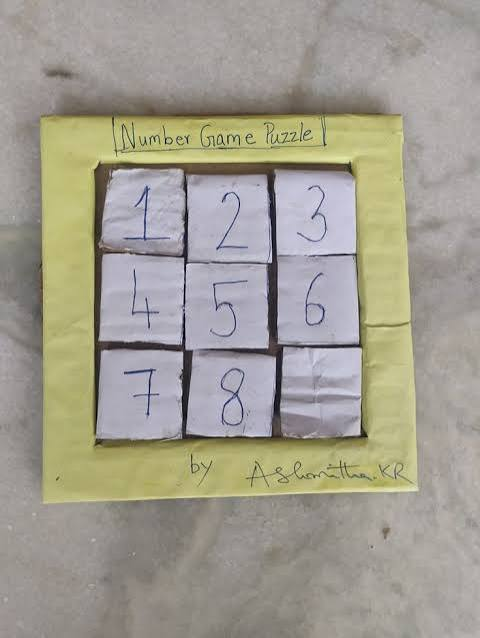
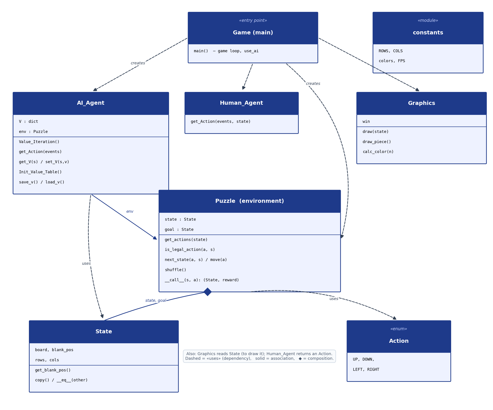
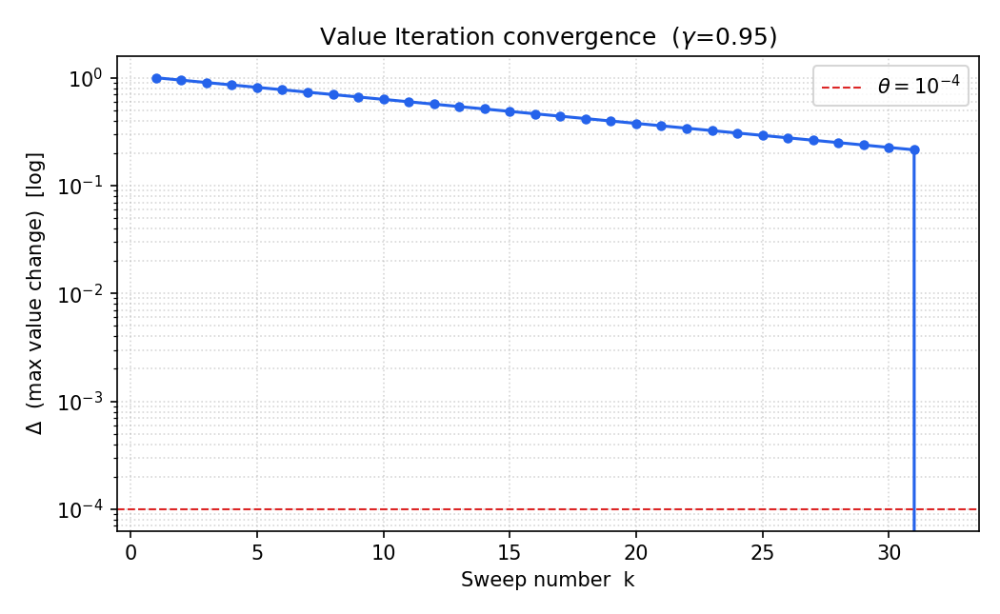
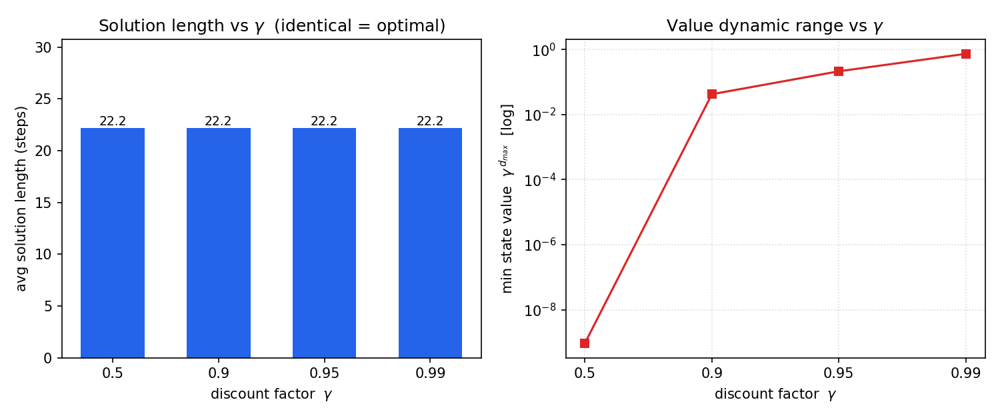
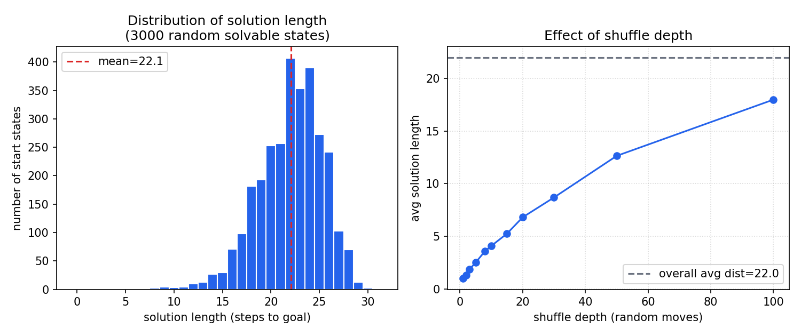

# PuzzleNumber-AI — Solving the 3×3 Number Puzzle with Value Iteration

A Reinforcement Learning project: an agent that solves the 3×3 sliding number
puzzle (the **8-Puzzle**) using **tabular Value Iteration** based on the Bellman
optimality equation. After the value function is computed, the agent follows it
**greedily** and reaches the goal from any solvable start state, in the minimum
number of moves.

<p align="center">
  
</p>
<p align="center"><i>The 3×3 number puzzle: eight numbered tiles and one empty square.</i></p>

- **Environment:** 3×3 board, eight numbered tiles + one blank; a tile adjacent to
  the blank can slide into it.
- **Algorithm:** tabular Value Iteration (dynamic programming), discount `γ = 0.95`.
- **Interface:** a pygame window that shows the agent solving the puzzle, plus a
  human-play mode.

---

## Attribution
The environment/framework — `Puzzle`, `State`, `Action`, `Graphics`, `Game`,
`Human_Agent`, `constants` — was provided as **starter code by the course
lecturer, Gilad Markman**. This repository is a fork of his project.

**Original starter repository:** https://github.com/MarkmanGilad/PuzzleNumber-AI

**My contribution:** implementing the `Value_Iteration` method in `AI_Agent.py`
(plus a safe default in `get_V`).

---

## What I changed and created

### Changed
| File | What I changed | Purpose |
|---|---|---|
| `AI_Agent.py` | Implemented the `Value_Iteration` method (it was an empty stub), and made `get_V` return a `0` default for unseen states. | The core of the project — building the value table `V(s)` that solves the puzzle. |
| `.gitignore` | Added rules to ignore the large generated value tables (`Data/V.pth`, `V_2.pth`, `V_3.pth`). | Keep the repository lightweight (the tables are rebuilt by the code). |

### Created
| File | Purpose |
|---|---|
| `README.md` | This document. |
| `class_diagram.png` | UML class diagram of the project (below). |
| `experiments/run_experiments.py` | Script that reproduces the three analysis figures. |
| `experiments/graph1_convergence.png` | Value-Iteration convergence graph. |
| `experiments/graph2_gamma.png` | Effect of the discount factor γ. |
| `experiments/graph3_distribution.png` | Distribution of solution lengths + shuffle-depth effect. |
| `experiments/requirements.txt` | The experiments' only extra dependency (`matplotlib`). |

---

## How the algorithm works

- **State:** the 3×3 board as a NumPy array, where `0` is the empty square.
- **Actions:** slide the blank **up / down / left / right** (the legal actions depend
  on the blank's position).
- **Reward:** `1` on reaching the goal, otherwise `0` (a *sparse* reward). Discount `γ = 0.95`.
- **Value Iteration** repeatedly sweeps over all states and updates each with the
  Bellman optimality rule until the values stabilise:

  ```
  V(s) = max over legal actions a of [ R(s, a) + γ · V(s') ]
  ```

  where `s'` is the state reached by action `a`. We stop when the largest change in a
  sweep, `Δ`, drops below `θ = 1e-4`. Because the only reward is at the goal, the
  values settle to roughly `γ^(distance-to-goal)`, so states nearer the goal have
  higher values.
- **Greedy policy:** at each step `get_Action` performs a one-step look-ahead and
  picks the action maximising `R + γ·V(next)` — which always moves the agent one step
  closer to the goal.

---

## Class diagram

<p align="center">
  
</p>

The classes and how they relate: **Game** (entry point) *creates* the agent
(`AI_Agent` or `Human_Agent`), the `Graphics` view and the `Puzzle` environment.
**AI_Agent** holds a reference to the **Puzzle** (`env`) and a value table `V`.
**Puzzle** is composed of **State** objects (`state`, `goal`) and uses **Action**.
Dashed arrows are *uses* (dependency), the solid arrow is an association, and the
filled diamond marks composition.

---

## Project structure

```
PuzzleNumber-AI/
├── AI_Agent.py        # the agent — Value_Iteration + greedy get_Action   (MY WORK)
├── Puzzle.py          # the environment: legal actions, transitions, reward   (lecturer)
├── State.py           # board state (NumPy array) + blank position             (lecturer)
├── Action.py          # UP / DOWN / LEFT / RIGHT enum                          (lecturer)
├── Graphics.py        # pygame drawing of the board                           (lecturer)
├── Human_Agent.py     # keyboard control for a human player                   (lecturer)
├── Game.py            # main loop; use_ai switches AI / human                 (lecturer)
├── constants.py       # board size, colours, FPS                             (lecturer)
├── requirements.txt   # pygame, numpy, torch                                  (lecturer)
├── class_diagram.png  # UML class diagram                                     (MY WORK)
├── Data/              # saved value tables (.pth)
└── experiments/       # analysis scripts + graphs                            (MY WORK)
```

---

## Run

```bash
pip install -r requirements.txt   # pygame, numpy, torch
python Game.py
```
In `Game.py`, the `use_ai` flag switches between the AI agent (`True`) and a human
player (`False`). In AI mode the program first runs Value Iteration, then solves the
puzzle step by step.

---

## Experiments

The scripts and graphs live in [`experiments/`](experiments/). To reproduce them:

```bash
cd experiments
pip install -r requirements.txt   # matplotlib
python run_experiments.py
```

> `run_experiments.py` is a **fast, standalone reproduction** of the algorithm
> (a pure-Python model of the puzzle, no pygame). It mirrors the same Bellman /
> Value-Iteration logic used in `AI_Agent.py`, so it runs headless in a few seconds.

### 1. Convergence of Value Iteration


`Δ` (the maximum change per sweep, log scale) starts at `1.0` and decreases
geometrically as the goal value propagates one "ring" of states outward per sweep.
After **32 sweeps** every reachable state (diameter = **31 moves**) has its final
value and `Δ` drops to `0`.

### 2. Effect of the discount factor γ


Across `γ ∈ {0.5, 0.9, 0.95, 0.99}` the **average solution length is identical
(~22 steps) and optimal** — the greedy policy depends only on the *ordering* of the
values, which discounting preserves. γ only changes the numeric dynamic range
(right panel): `γ^30` collapses from ~0.21 at γ = 0.95 to ~9×10⁻¹⁰ at γ = 0.5.

### 3. Distribution of solution lengths & shuffle depth


Over **3000 random solvable start states** the agent solved every one. Solution
length is bell-shaped, **mean ≈ 22**, range **8–31** (matching the 31-move diameter).
A deeper shuffle produces harder start states, with the average length rising and
then flattening.
